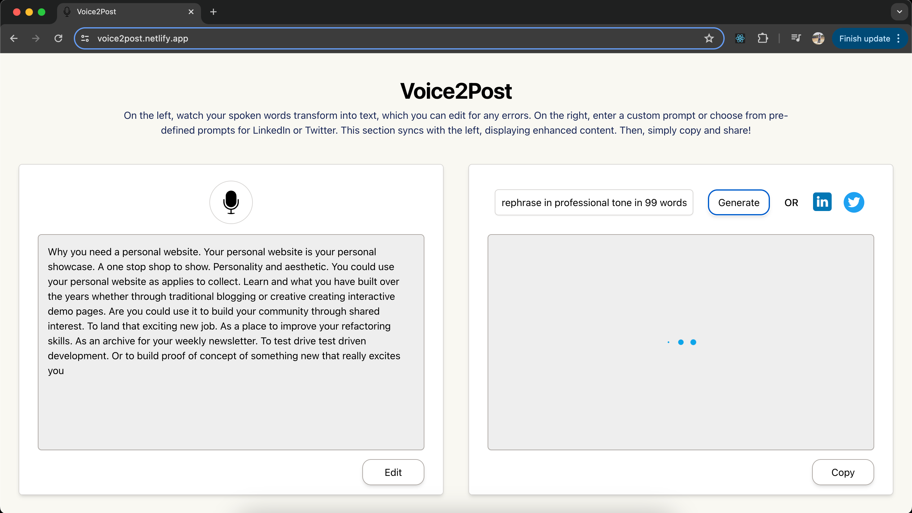

# Voice2Post

Try yourself: [Live demo](https://voice2post.netlify.app/)

## Description
Voice2Post is a web application leveraging the Web Speech API to convert user speech into text. Enhanced by OpenAI's APIs, users can refine the text quality with custom or predefined prompts for LinkedIn and Twitter. The application also features text editing capabilities to ensure accuracy before finalization. Once perfected, simply copy the final result and you’re good to go!

## Features
- Convert speech to text using Web Speech API
- Enhance text quality with AI-powered by OpenAI
- Use custom prompts or pre-defined prompts for LinkedIn and Twitter
- Edit recorded text for accuracy
- Easy copy and paste of the final result

## Snapshots

1. Start / Stop recording speech by clicking on mic icon \[it will automatically stop after a while if no audio is being captured]

    

2. Use "Edit" button to update any inconsistency in speech and text

3. To generate AI enhanced content, you have three options: 

   Write custom prompt and click "Generate" button

   

   Click on "LinkedIn" icon to enhance content for a linkedIn post

   

   Click on "Twitter" icon to enhance content for a tweet

    

   Intermediate loading screen

   

4. Click on "Copy" button and use generated result

    

